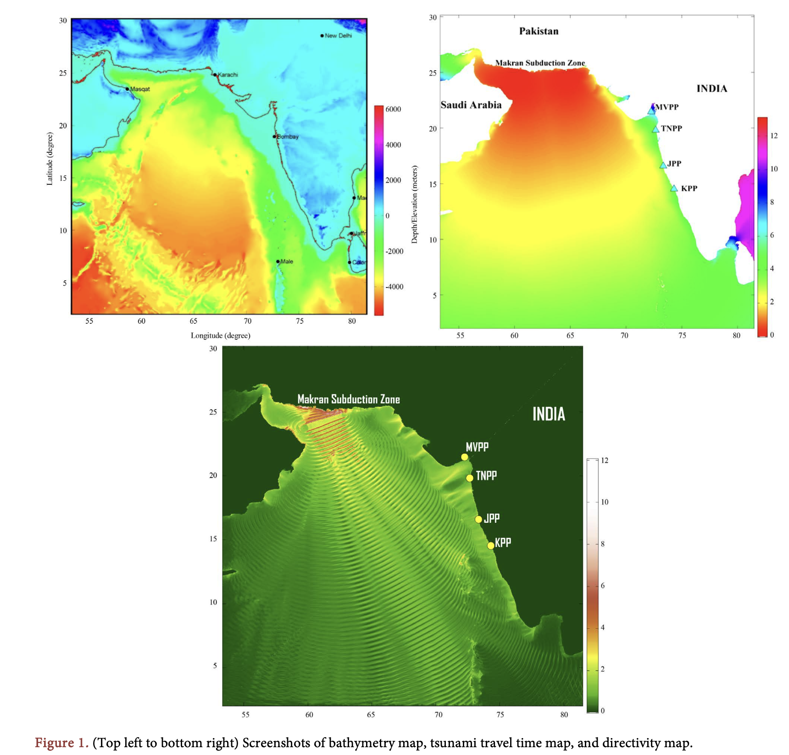
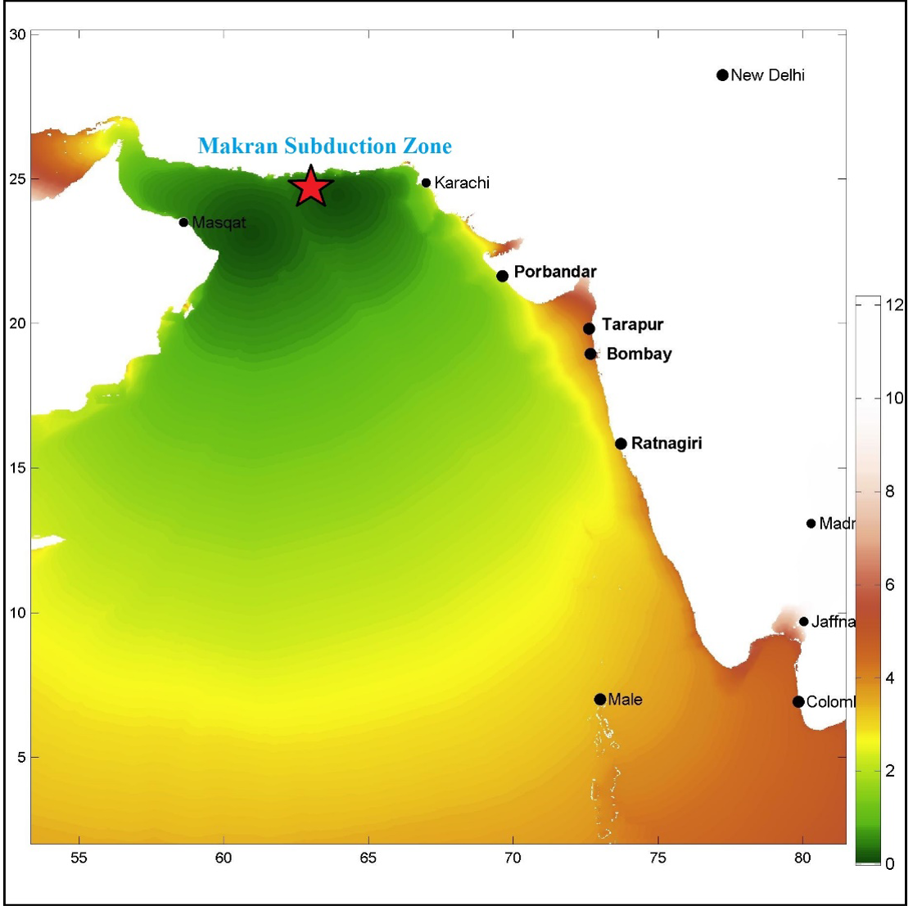
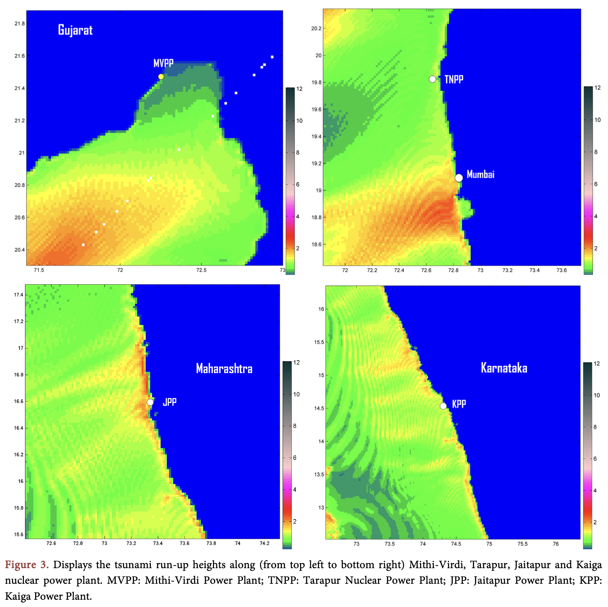

# Coastal hazard and tsunami risk mapping

This project demonstrates the integration of geospatial data science with numerical modelling for disaster risk assessment, highlighting its potential to mitigate natural hazards and safeguard critical infrastructure. This work has been published in a peer-reviewed journal article: https://www.scirp.org/journal/PaperInformation?PaperID=81083&#abstract 

The repository presents a comprehensive tsunami hazard analysis for nuclear power plants along the western coast of India, using numerical simulations based on a potential Great Makran Earthquake (M9.0). The study integrates geospatial datasets, numerical modelling, and data visualization to evaluate the potential tsunami impacts, including arrival times, run-up heights, and wave propagation.

---

## Key Features
- **Tsunami Simulation**:
  - Implemented the **TUNAMI N2** model, leveraging finite-difference methods to simulate tsunami propagation, arrival times, and inundation patterns.
  - Modeled tsunami waves triggered by subduction zone activity in the Makran region.

- **Geospatial Data Integration**:
  - Utilized 1-minute resolution bathymetry data from **GEBCO** for accurate modeling.
  - Integrated nuclear power plant locations, coastal elevations, and fault data for hazard assessment.

- **Hazard Analysis**:
  - Calculated tsunami arrival times and run-up heights for four key nuclear power plant sites (Jaitapur, Tarapur, Kaiga, and Mithi-Virdi).
  - Identified site-specific risks based on tsunami wave energy, coastal shelf width, and infrastructure proximity.

- **Data Visualization**:
  - Generated propagation maps, directivity maps, and run-up height visualizations using **MATLAB**.

---

## Technologies and Tools
- **Modeling Framework**: TUNAMI N2 (Finite-Difference Modeling)
- **Programming**: MATLAB for data processing and visualization
- **Data Sources**:
  - Bathymetric Data: GEBCO
  - Nuclear Power Plant Locations: Google Earth
- **Geospatial Analysis**: Coastal hazard and tsunami risk mapping

---

## Applications
- Disaster Preparedness: Provides critical insights for evacuation planning and early warning system implementation.
- Infrastructure Resilience: Assesses the vulnerability of nuclear power plants to tsunami hazards.
- Research and Policy: Supports geophysical and geospatial studies to inform policy decisions on coastal development and hazard mitigation.

---
## Figures

**Study Area and Datasets**

--------

**Results**

Figure 2: Tsunami propagation model in the Arabian sea due to the Makran induced tsunami by a great earthquake (M 9). The screenshots (top left to bottom right) are showing tsunami propagation after 0, 60, 120, 180, 240, 300 and 360 minutes after the earthqauke.

---------

