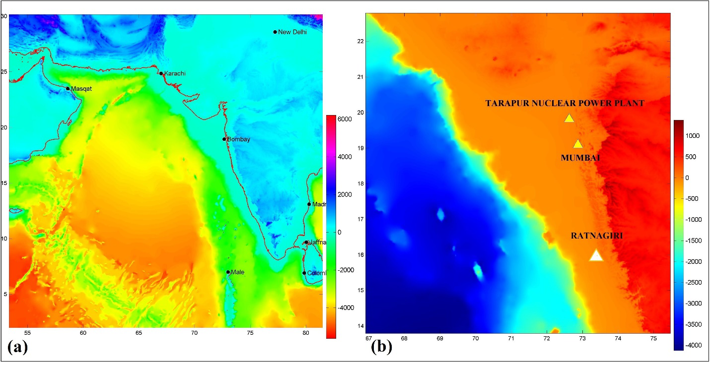
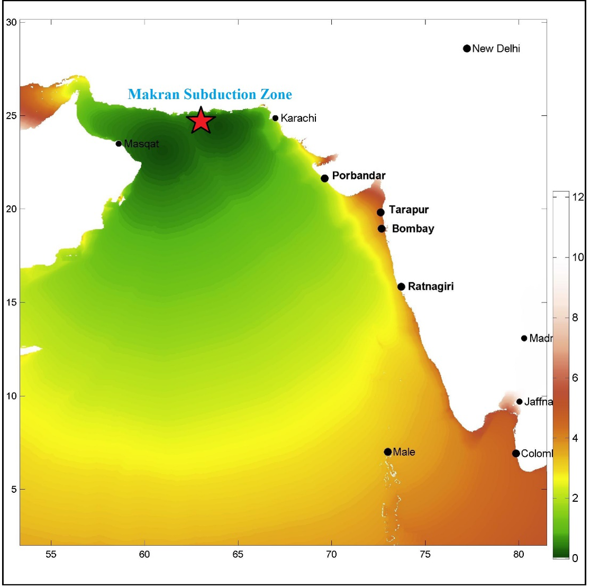
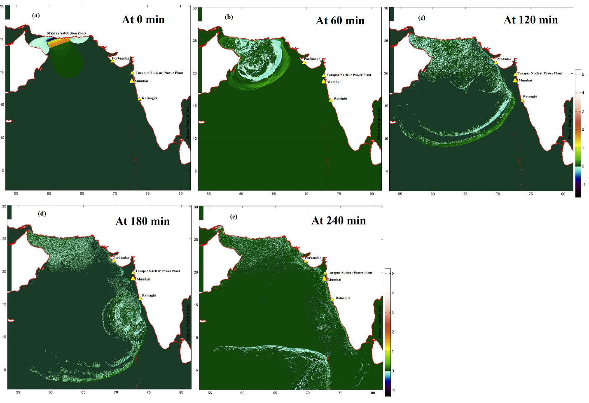
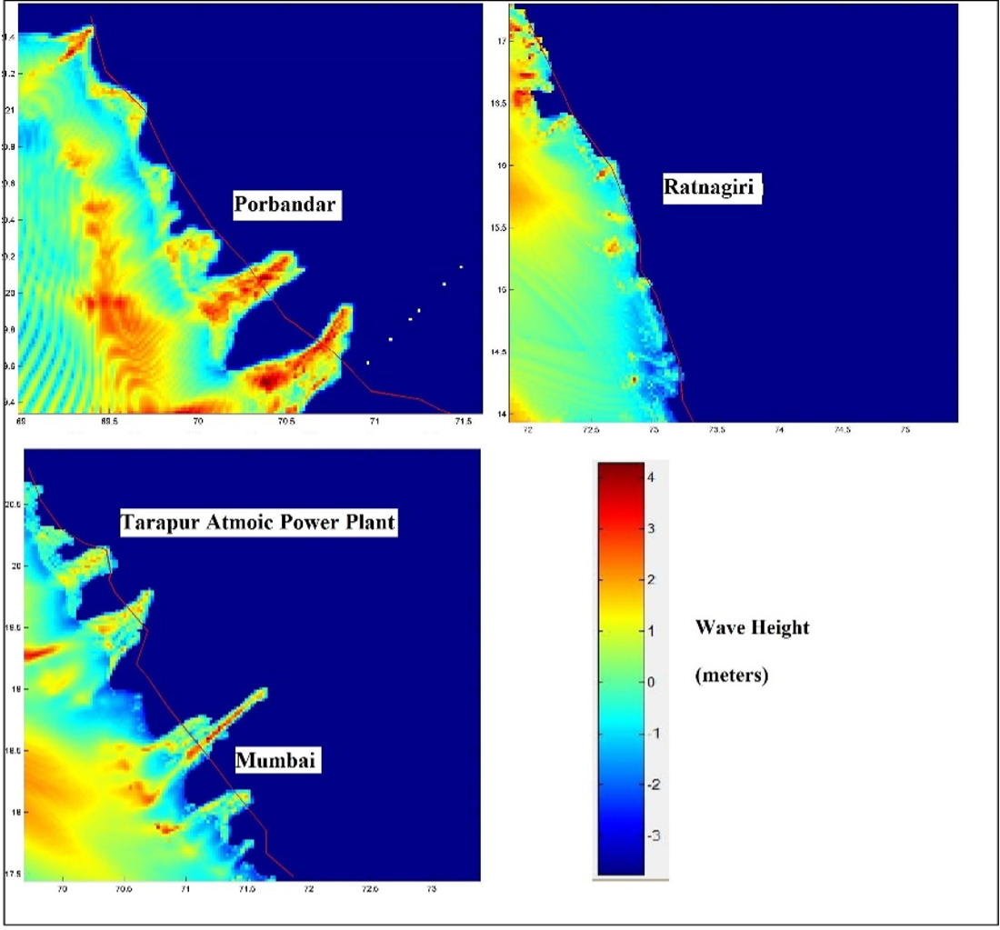

# Coastal hazard and tsunami risk mapping

The project presents a comprehensive tsunami hazard analysis for nuclear power plants along the western coast of India, using numerical simulations based on a potential Great Makran Earthquake (M9.0). The study integrates geospatial datasets, numerical modelling, and data visualization to evaluate the potential tsunami impacts, including arrival times, run-up heights, and wave propagation.

This work has been published in a peer-reviewed journal article: https://www.scirp.org/journal/PaperInformation?PaperID=81083&#abstract 

---

## Figures

**Study Area and Datasets**

Figure 1: Bathymetry (GEBCO) (a) and Topography (SRTM) (b) maps 

--------

**Results**

Figure 2: Modelled Travel time of tsunami waves from the source

---------

Figure 3: Tsunami propagation at different time intervals.

-------

Figure 4: Predicted Tsunami heights at different Nuclear Power Plant sites.
